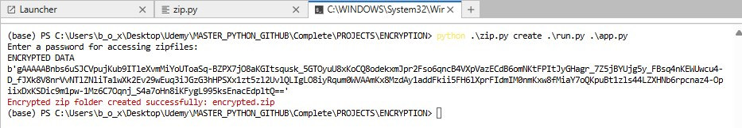
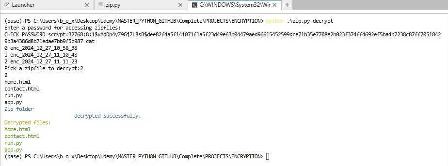
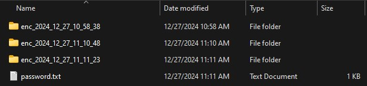

# CLI App for File Encryption and Decryption

## Overview
This CLI (Command-Line Interface) application allows users to securely encrypt and decrypt files using Python. It utilizes the `cryptography` library for encryption and `werkzeug.security` for secure password hashing and verification. Additionally, it supports ZIP compression for handling files, ensuring a seamless and secure workflow for file management.

The project is organized into the following folders and files:

- **`ENC/`**: Stores encrypted and decrypted files.
- **`images/`**: Contains example screenshots for guidance.
- **`app.py`**: Main script implementing the CLI functionality.
- **`.gitignore`**: Specifies files and folders to exclude from version control.
- **`README.md`**: Documentation for the repository.

---

## Features

1. **File Encryption:**
   - Compresses files into a ZIP archive.
   - Encrypts the archive using the `cryptography` library.
   - Stores the encryption key in a secure location.

2. **File Decryption:**
   - Verifies the user-provided password against the stored hash.
   - Decrypts the ZIP archive.
   - Extracts files to the specified directory.

3. **Password Management:**
   - Securely hashes passwords using `werkzeug.security`.
   - Verifies passwords before decryption.

4. **Folder Management:**
   - Automatically creates subfolders with timestamps for each operation.
   - Renames folders to distinguish between encrypted and decrypted content.

---

## Usage

### Commands

- **Encrypt Files**
  ```bash
  python app.py create <file_paths> -pw <password>
  ```
  Example:
  ```bash
  python app.py create file1.txt file2.txt -pw mypassword
  ```
  
- **Decrypt Files**
  ```bash
  python app.py decrypt -pw <password>
  ```
  Example:
  ```bash
  python app.py decrypt -pw mypassword
  ```

### Options
- `-pw`: Specifies the password for encrypting or decrypting files.

---

## Examples and Screenshots

### Encrypting Files
The image below demonstrates how the files are encrypted into a ZIP archive:



### Decrypting Files
The image below shows the process of decrypting an encrypted folder:



### Folder Structure
The image below illustrates the folder structure after performing encryption:



---

## Security Considerations
- **Password Storage:** Passwords are hashed before storage to enhance security.
- **Key Management:** The encryption key is stored in a separate file within the timestamped folder for each operation.

---

## Contributions
Feel free to contribute by submitting issues or pull requests. For major changes, please open an issue first to discuss what you would like to change.

---
